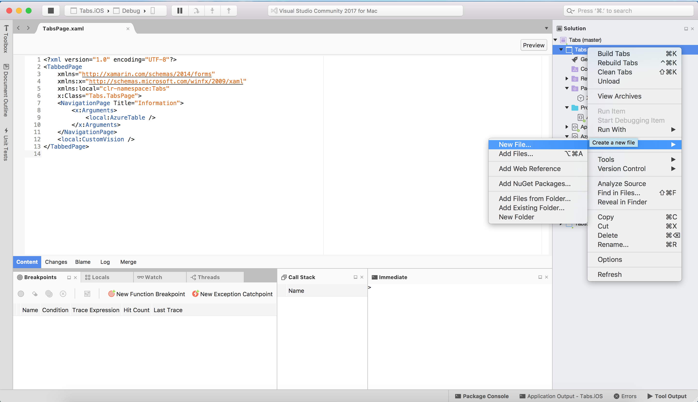

# Tabbed Page

## Navigating between pages using tabs

### The Xamarin.Forms TabbedPage consists of a list of tabs and a larger detail area, with each tab loading content into the detail area. This article demonstrates how to use a TabbedPage to navigate through a collection of pages.

# Overview
The following screenshots show a TabbedPage on each platform:


The following screenshots focus on the tab format on each platform:


# Creating a Tabbed Page with Navigation Page

1. Create a project called Tabs. In the TabsPage.xaml, paste in the following code

```xml
<?xml version="1.0" encoding="UTF-8"?>
<TabbedPage 
    xmlns="http://xamarin.com/schemas/2014/forms" 
    xmlns:x="http://schemas.microsoft.com/winfx/2009/xaml" 
    xmlns:local="clr-namespace:Tabs" 
    x:Class="Tabs.TabsPage">
    <NavigationPage Title="Information">
        <x:Arguments>
            <local:AzureTable />
        </x:Arguments>
    </NavigationPage>
    <local:CustomVision />
</TabbedPage>
```
2. Right Click on "Tabs", the name of the project and click Add -> New File...



* Click Forms -> Forms ContentPage Xaml

* Call your file AzureTable


Paste in the following code into AzureTables.Xaml

```xml
<?xml version="1.0" encoding="UTF-8"?>
<ContentPage xmlns="http://xamarin.com/schemas/2014/forms" xmlns:x="http://schemas.microsoft.com/winfx/2009/xaml" x:Class="Tabs.AzureTable">
	<ContentPage.Content>
        <Label Text="Azure Tables Navigation Page Tab" VerticalOptions="Center" HorizontalOptions="Center" />
	</ContentPage.Content>
</ContentPage>
```

3. Repeat step two again to create another file called CustomVision and paste the following code into CustomVision.Xaml

```xml
<?xml version="1.0" encoding="UTF-8"?>
<ContentPage xmlns="http://xamarin.com/schemas/2014/forms" xmlns:x="http://schemas.microsoft.com/winfx/2009/xaml" x:Class="Tabs.CustomVision" Title= "Custom Vision">
	<ContentPage.Content>
        <Label Text="Custom Vision Tab" VerticalOptions="Center" HorizontalOptions="Center" />
	</ContentPage.Content>
</ContentPage>

```

4. Change the type of TabsPage.Xaml.cs to "TabbedPage"

```csharp
using Xamarin.Forms;

namespace Tabs
{
    public partial class TabsPage : TabbedPage
    {
        public TabsPage()
        {
            InitializeComponent();
        }
    }
}
```

Run your application. 

Notice how on the different platforms the Tabs look different, this is because Xamarin.Forms will uphold the required formatting to give you the most native experience. 

For Example, on Android the tabs are at the top due to the requirements google have provided for material design. 

## Extra for experts

* Add the following line to the end of your AssemblyInfo.cs file 

```chsarp
[assembly: XamlCompilation(XamlCompilationOptions.Compile)]
```

* Add the using statement at the top of your file as well

```csharp
using Xamarin.Forms.Xaml;
```

What does this code do? 