# 6.2 Creating an Azure Mobile App with Easy Tables

## Introduction
So now that we have a database attached to our backend server (mobile app), we now want our client application (xamarin application) to do GET and POST requests to the database.

As our server is hosted as a mobile app we could just use a HTTP request. However there exists a managed client SDK package for Mobile Apps (`Microsoft.Azure.Mobile.Client`) that we can use to work with our server. 

This similar interaction with mobile app can be done with native applications such as Android, iOS and hence Xamarin.

###  SOURCE: [Getting Started with Azure Mobile Apps’ Easy Tables](https://blog.xamarin.com/getting-started-azure-mobile-apps-easy-tables/)

# Creating a New Azure Mobile App
Inside of the Azure portal, simply select New -> Web + Mobile -> Mobile App, which is the starting point to configure your Azure Mobile App backend.

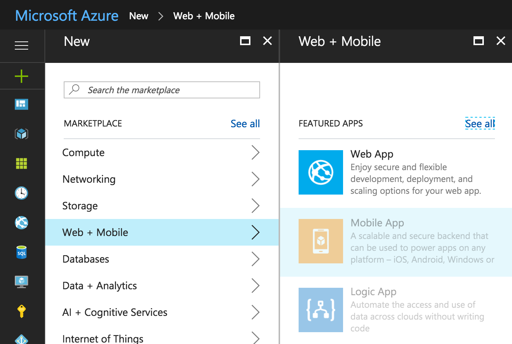

When selecting Mobile App in Azure, you will need to configure the service name (this is the URL where your backend web app/ASP.NET website will live), configure your subscription, and set your resource group and plan. I call Seattle home, so I’ve selected the default West US locations:

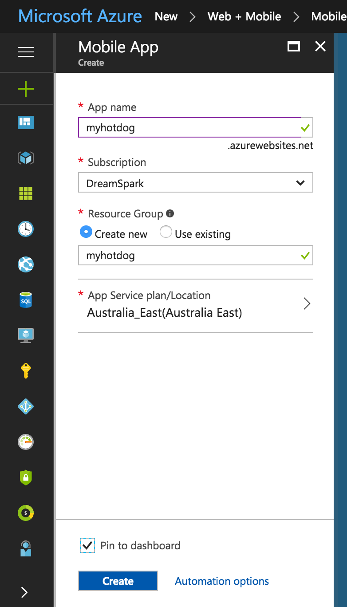

Give Azure a few minutes to deploy your mobile app, and once deployed, the Azure portal will bring you directly to the configuration screen with the settings tab open. All of the settings we’ll adjust can be found under the Mobile section:

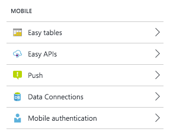

## Add Data Connection

We can’t have a backend for our mobile apps without a database. Under the Data Connections section, select Add, and then configure a new SQL database as I’ve done below:

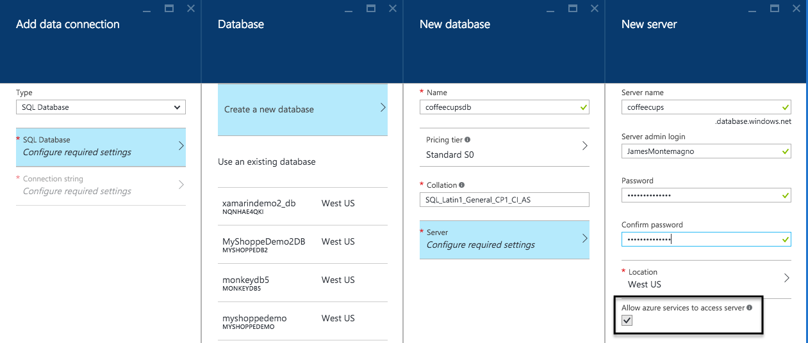

Make sure that you keep Allow azure services to access server checked for your mobile app to allow services to properly connect to the database server. Also, be sure to keep your password in a secure place as you may need it in the future.

Click OK on all open blades and Azure will begin to create the database for us on the fly. To see the progress of database creation live, click on the notifications button in the upper-righthand corner:

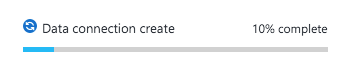

When the data connection is created, it will appear in the Mobile Apps data connections blade, which means it’s time to set up the data that will go in the new database.

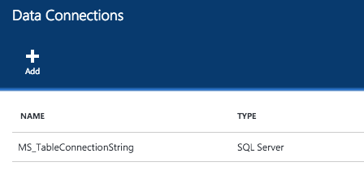

## Adding a New Table
Under Mobile settings is a new section called Easy Tables, which enable us to easily set up and control the data coming to and from the iOS and Android apps. Select the Easy Tables section, and we’ll be prompted with a big blue warning asking us to configure Easy Tables/Easy APIs:

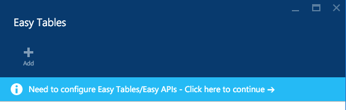

Since we already setup the database, the only thing left to do is Initialize the app.

After a few moments, the app will be fully initialized so we can add our first table of the database named NotHotDogModel. If you are adding Azure Mobile Apps to an existing application, this table name should match the class name of the data you with to store. The beautiful part of Easy Tables is that it will automatically update and add the columns in the table dynamically based on the data we pass in. For this example, I’ll simply allow full anonymous access to the table, however it is possible to add authentication with Facebook, Twitter, Google, Microsoft, and other OAuth login providers.

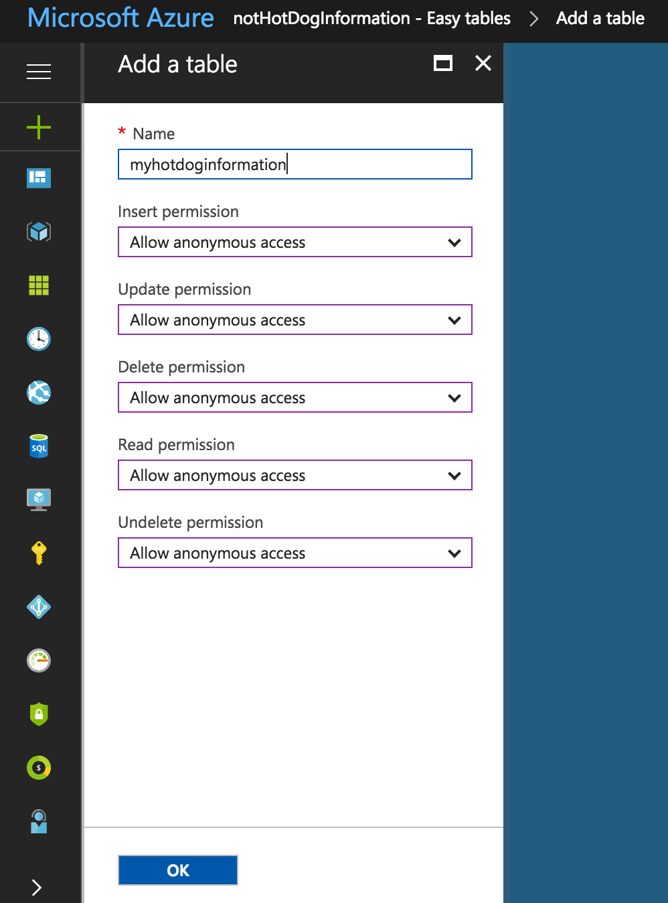

### Important
For this tutorial make sure you have an easy table in your mobile backend called `NotHotDogModel`, as we reference it by name 

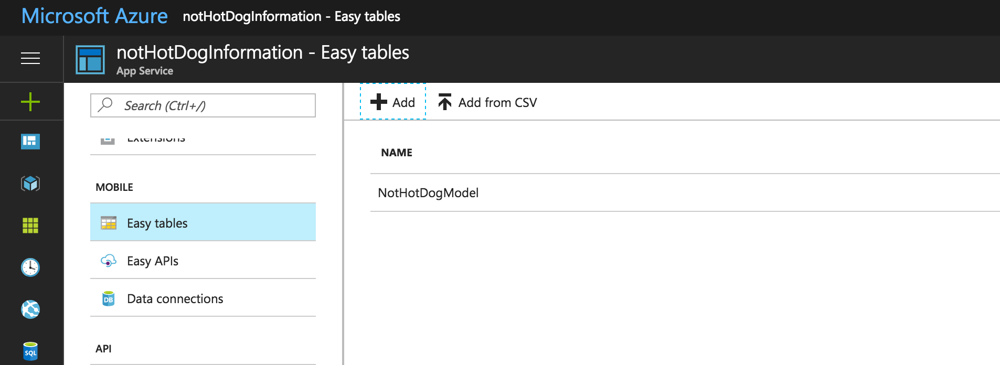

## Resources
### Bootcamp Content
* [Video - Waiting](http://link.com)

## 1. Postman requests 
Lets first see how our data looks like by making a GET request to `https://MOBILE_APP_URL.azurewebsites.net/tables/NotHotDogModel` (replace `MOBILE_APP_URL` with your server name, for this demo its "hellotheretest").
- /tables to access our easy tables
- `/nothotdogmodel` is the specific table we want to make requests to, so in the server `https://nothotdoginformation.azurewebsites.net/` there is an easytable called `NotHotDogModel`

NOTE: When we make requests to our backend thats hosted as a MOBILE_APP, we need to add the following header to our requests
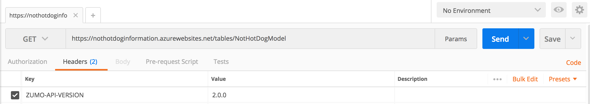

GET Request and response (If yours doesnt show any data ie just `[]` that means nothing is in your table! Dont worry, later when we take photos, if we make another request we will see data)
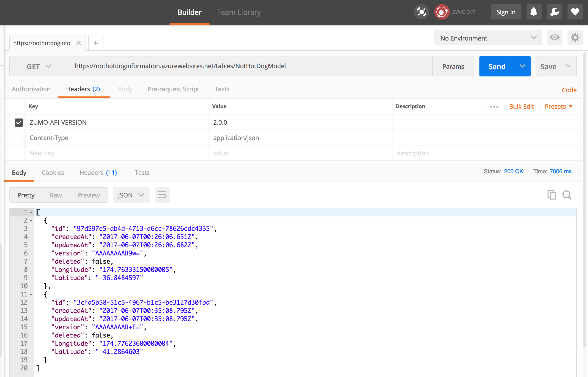

Here we can see it matches well with whats in our current backend database (with data)
![GET Request]

Now with a POST request, we want to add new information to the backend database
Because its easy tables, the schema is adjusted to what we send because it dynamically matches. So we can use any key and value pairings but to keep it consisent its normally better to keep to one schema rather than change it every 5 mins.

We will send a JSON request with Latitude and Longitude values
(Note the body-content type is `raw` and of `JSON (application/json)` type)
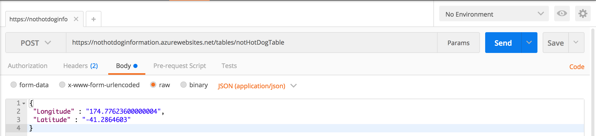

Now we see that it has added the new entry to our database. 
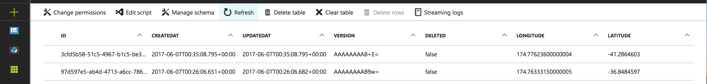

NOTE: The other fields we didnt give values in our POST request (contempt, disgust ..) are defaulted to null values

### Extra Learning Resources
* [Using App Service with Xamarin by Microsoft](https://azure.microsoft.com/en-us/documentation/articles/app-service-mobile-dotnet-how-to-use-client-library/)
* [Using App Service with Xamarin by Xamarin - Outdated but good to understand](https://blog.xamarin.com/getting-started-azure-mobile-apps-easy-tables/)
* [ListView in Xamarin](https://developer.xamarin.com/guides/xamarin-forms/user-interface/listview/)
