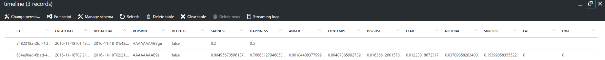
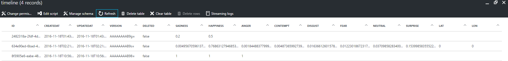

# 3.4. Integrate Database to Solution 

## Introduction
So now that we have a database attached to our backend server (mobile app), we now want our client application (xamarin application) to do GET and POST requests to the database.

As our server is hosted as a mobile app we could just use a HTTP request. However there exists a managed client SDK package for Mobile Apps (`Microsoft.Azure.Mobile.Client`) that we can use to work with our server. 

This similar interaction with mobile app can be done with native applications such as Android and iOS.
Here in this tutorial we can see that interacting with the backend is the same for Xamarin and Bot Framework as they are both in C#.

For full understanding of working with the backend please refer to the `2. Xamarin` as `3. Bot Framework` just references it.

The completed project of both the Xamarin and Bot are included in this folder.

### Important
For this tutorial make sure you have an easy table in your mobile backend called `timeline`, as we reference it by name 


## Resources
### Bootcamp Content
* [Video - Waiting](http://link.com)

## 1. Postman requests 
Lets first see how our data looks like by making a GET request to `https://MOBILE_APP_URL.azurewebsites.net/tables/timeline` (replace `MOBILE_APP_URL` with your server name, for this demo its "hellotheretest").
- /tables to access our easy tables
- `/timeline` is the specific table we want to make requests to, so in the server `https://hellotheretest.azurewebsites.net/` there is an easytable called `timeline`

NOTE: When we make requests to our backend thats hosted as a MOBILE_APP, we need to add the following header to our requests


GET Request and response (If yours doesnt show any data ie just `[]` that means nothing is in your table! Dont worry, later when we take photos, if we make another request we will see data)


Here we can see it matches well with whats in our current backend database (with data)


Now with a POST request, we want to add new information to the backend database
Because its easy tables, the schema is adjusted to what we send because it dynamically matches. So we can use any key and value pairings but to keep it consisent its normally better to keep to one schema rather than change it every 5 mins.

We will send a JSON request with happiness, sadness and anger values
(Note the body-content type is `raw` and of `JSON (application/json)` type)


Now we see that it has added the new entry to our database. 


NOTE: The other fields we didnt give values in our POST request (contempt, disgust ..) are defaulted to null values

## 2. Xamarin

### 2.1 Referencing Azure Mobile Services
At the earlier sections, we would have already added it to our Nuget Packages. If not

- For Visual Studio: Right-click your project, click Manage NuGet Packages, search for the `Microsoft.Azure.Mobile.Client` package, then click Install.
- For Xamarin Studio: Right-click your project, click Add > Add NuGet Packages, search for the `Microsoft.Azure.Mobile.Client` package, and then click Add Package.

NOTE: Make sure to add it to all your solutions!

If we want to use this SDK we add the following using statement
```C#
using Microsoft.WindowsAzure.MobileServices;
``` 

### 2.2 Creating Model Classes
Lets now create model class `Timeline` to represent the tables in our database. 
So in `Moodify (Portable)`, create a folder named `DataModels` and then create a `Timeline.cs` file with,

NOTE: If your table in your backend is not called timeline, rename it or rename this class and file to match.

```C#
public class Timeline
{
    [JsonProperty(PropertyName = "Id")]
    public string ID { get; set; }

    [JsonProperty(PropertyName = "anger")]
    public double Anger { get; set; }

    [JsonProperty(PropertyName = "contempt")]
    public double Contempt { get; set; }

    [JsonProperty(PropertyName = "disgust")]
    public double Disgust { get; set; }

    [JsonProperty(PropertyName = "fear")]
    public double Fear { get; set; }
    
    [JsonProperty(PropertyName = "happiness")]
    public double Happiness { get; set; }
    
    [JsonProperty(PropertyName = "neutral")]
    public double Neutral { get; set; }
    
    [JsonProperty(PropertyName = "sadness")]
    public double Sadness { get; set; }
    
    [JsonProperty(PropertyName = "surprise")]
    public double Surprise { get; set; }
    
    [JsonProperty(PropertyName = "createdAt")]
    public DateTime Date { get; set; }
    
    [JsonProperty(PropertyName = "lat")]
    public double Lat { get; set; }
    
    [JsonProperty(PropertyName = "lon")]
    public double Lon { get; set; }
}
``` 

- `JsonPropertyAttribute` is used to define the PropertyName mapping between the client type and the table 
- Important that they match the field names that we got from our postman request (else it wont map properly)
- Our field names for our client types can then be renamed if we want (like the field `date`)
- All client types must contain a field member mapped to `Id` (default a string). The `Id` is required to perform CRUD operations and for offline sync (not discussed) 

### 2.3 Initalize the Azure Mobile Client
Lets now create a singleton class named `AzureManager` that will look after our interactions with our web server. Add this to the class
(NOTE: replace `MOBILE_APP_URL` with your server name, for this demo its "https://hellotheretest.azurewebsites.net/")


So in `Moodify (Portable)`, create a `AzureManager.cs` file with,

```C#
public class AzureManager
    {

        private static AzureManager instance;
        private MobileServiceClient client;

        private AzureManager()
        {
            this.client = new MobileServiceClient("MOBILE_APP_URL");
        }

        public MobileServiceClient AzureClient
        {
            get { return client; }
        }

        public static AzureManager AzureManagerInstance
        {
            get
            {
                if (instance == null) {
                    instance = new AzureManager();
                }

                return instance;
            }
        }
    }
``` 

Now if we want to access our `MobileServiceClient` in an activity we can add the following line,
```C#
    MobileServiceClient client = AzureManager.AzureManagerInstance.AzureClient;
``` 


### 2.4 Creating a table references
For this demo we will consider a database table a `table`, so all code that accesses (READ) or modifies (CREATE, UPDATE) the table calls functions on a `MobileServiceTable` object. 
These can be obtained by calling the `GetTable` on our `MobileServiceClient` object.

Lets add our `timelineTable` field to our `AzureManager` activity 
```C#
    private IMobileServiceTable<Timeline> timelineTable;
``` 

And then the following line at the end of our `private AzureManager()` function
```C#
    this.timelineTable = this.client.GetTable<Timeline>();
```

This grabs a reference to the data in our `Timeline` table in our backend and maps it to our client side model defined earlier.

We can then use this table to actually get data, get filtered data, get a timeline by id, create new timeline, edit timeline and much more.

### 2.5 Grabbing timeline data
To retrieve information about the table, we can invoke a `ToListAsync()` method call, this is asynchronous and allows us to do LINQ querys.

Lets create a `GetTimelines` method in our `AzureManager.cs` file
```C#
    public async Task<List<Timeline>> GetTimelines() {
        return await this.timelineTable.ToListAsync();
    }
``` 

Lets create a button in our `HomePage.xaml` file after our other button
```xaml
      <Button Text="See Timeline" TextColor="White" BackgroundColor="Red" Clicked="ViewTimeline_Clicked" />
``` 

Before the closing tag of the stacklayout in our `HomePage.xaml` file (`</StackLayout>`), add the following list view
```xaml
    <ListView x:Name="TimelineList" HasUnevenRows="True">
        <ListView.ItemTemplate>
          <DataTemplate>
            <ViewCell>
              <Grid>
                <Grid.RowDefinitions>
                  <RowDefinition Height="Auto" />
                </Grid.RowDefinitions>
                <Grid.ColumnDefinitions>
                  <ColumnDefinition Width="50*" />
                  <ColumnDefinition Width="50*" />
                  <ColumnDefinition Width="50*" />
                </Grid.ColumnDefinitions>
                <Label Grid.Column="1" Text="{Binding Date}"/>
                <Label Grid.Column="0" Text="{Binding Happiness}"/>
                <Label Grid.Column="2" Text="{Binding Anger}"/>
              </Grid>
            </ViewCell>
          </DataTemplate>
        </ListView.ItemTemplate>
      </ListView>
```
Here we added a template for the timeline object values, showing the `Date`, `Happiness` and `Anger` values by using `Binding` ie `Text="{Binding Happiness}"`. This is a very simple way to display all our values and can be futher extended to display it in a aesthetic manner.
This associates the value of the field of the timeline object and displays it.


Now to can call our `GetTimelines` function, we can add the following method in our `HomePage.xaml.cs` class
```C#
    
        private async void ViewTimeline_Clicked(Object sender)
        {
            List<Timeline> timelines = await AzureManager.AzureManagerInstance.GetTimelines();
            
            TimelineList.ItemsSource = timelines;

        }
``` 

This will then set the source of the list view  `TimelineList` to the list of timelines we got from our backend

[More Info on ListView](https://developer.xamarin.com/guides/xamarin-forms/user-interface/listview/) about customising the appearance of your list view

[MORE INFO] A LINQ query we may want to achieve is if we want to filter the data to only return high happiness songs. 
We could do this by the following line, this grabs the timelines if it has a happiness of 0.5 or higher
```C#
    public async Task<List<Timeline>> GetHappyTimelines() {
        return await timelineTable.Where(timeline => timeline.Happiness > 0.5).ToListAsync();
    }
``` 

### 2.6 Posting timeline data
To post a new timeline entry to our backend, we can invoke a `InsertAsync(timeline)` method call, where `timeline` is a Timeline object.

Lets create a `AddTimeline` method in our `AzureManager.cs` file

```C#
    public async Task AddTimeline(Timeline timeline) {
        await this.timelineTable.InsertAsync(timeline);
    }
``` 

NOTE: If a unique `Id` is not included in the `timeline` object when we insert it, the server generates one for us.


Now to can call our `AddTimeline` function, we can do the following in our `HomePageXaml.cs` class at the end of the `TakePicture_Clicked` method so that each response from cognitive services is uploaded

Add this code after the  line `EmotionView.ItemsSource = result[0].Scores.ToRankedList();`

```C#
    var temp = result[0].Scores;

    Timeline emo = new Timeline()
    {
        Anger = temp.Anger,
        Contempt = temp.Contempt,
        Disgust = temp.Disgust,
        Fear = temp.Fear,
        Happiness = temp.Happiness,
        Neutral = temp.Neutral,
        Sadness = temp.Sadness,
        Surprise = temp.Surprise,
        Date = DateTime.Now
    };

    await AzureManager.AzureManagerInstance.AddTimeline(emo);
``` 

This creates a `Timeline` object and sets up the values from the `result` (from cognitive services) and then adds it to backends database

### 2.6 [More Info] Updating and deleting timeline data
To edit an existing timeline entry in our backend, we can invoke a `UpdateAsync(timeline)` method call, where `timeline` is a Timeline object. 

The `Id` of the timeline object needs to match the one we want to edit as the backend uses the `id` field to identify which row to update. This applies to delete as well.

Timeline entries that we retrieve by `ToListAsync()`, will have all the object's corresponding `Id` attached and the object returned by the result of `InsertAsync()` will also have its `Id` attached.

Lets create a `UpdateTimeline` method in our `AzureManager` activity 
```C#
    public async Task UpdateTimeline(Timeline timeline) {
        await this.timelineTable.UpdateAsync(timeline);
    }
``` 

NOTE: If no `Id` is present, an `ArgumentException` is raised.


To edit an existing timeline entry in our backend, we can invoke a `DeleteAsync(timeline)` method call, where `timeline` is a Timeline object. 
Likewise information concerning `Id` applies to delete as well.

Lets create a `DeleteTimeline` method in our `AzureManager` activity 
```C#
    public async Task DeleteTimeline(Timeline timeline) {
        await this.timelineTable.DeleteAsync(timeline);
    }
``` 
## 3. Bot Framework
Like what we did in Xamarin, the same SDK `Microsoft.Azure.Mobile.Client` can be used to interact with our backend.

For now we will just see if we can grab the same data as our Xamarin application and display it to the user.

Follow steps `2.1 Referencing Azure Mobile Services` to `2.4 Creating a table references`, such that your `AzureManager.cs` file is in the main root folder.


### 3.1 Grabbing timeline data
Lets create a `GetTimelines` method in our `AzureManager.cs` file
```C#
    public async Task<List<Timeline>> GetTimelines() {
        return await this.timelineTable.ToListAsync();
    }
``` 

And then in our `MessagesController.cs` add the following command code (so whenever this phrase is entered do this) before `if (!isWeatherRequest)`

```C#
    if (userMessage.ToLower().Equals("get timelines"))
    {
        List<Timeline> timelines = await AzureManager.AzureManagerInstance.GetTimelines();
        endOutput = "";
        foreach(Timeline t in timelines)
        {
            endOutput += "[" + t.Date + "] Happiness " + t.Happiness + ", Sadness " + t.Sadness +  "\n\n";
        }
        isWeatherRequest = false;

    }
```

So that if we type a message of `get timelines` to the bot, it would retrieve all the timelines and display the `Date` and its associated `Happiness` and `Sadness`.

### 3.2 Posting/Updating/Deleting timeline data
All of this is very much like how it was done the Xamarin tutorial.

ie Adding a new timeline entry to the backend database would be adding this to  in our `AzureManager.cs` file

```C#
    public async Task AddTimeline(Timeline timeline) {
        await this.timelineTable.InsertAsync(timeline);
    }
``` 

And adding this in our `MessagesController.cs` before `if (!isWeatherRequest)`
This will then add a new entry of timeline to the table with these values whenever the user types `new timeline`
```C#
    if (userMessage.ToLower().Equals("new timeline"))
    {
        Timeline timeline = new Timeline()
        {
            Anger = 0.1,
            Contempt = 0.2,
            Disgust = 0.3,
            Fear = 0.3,
            Happiness = 0.3,
            Neutral = 0.2,
            Sadness = 0.4,
            Surprise = 0.4,
            Date = DateTime.Now
        };

        await AzureManager.AzureManagerInstance.AddTimeline(timeline);

        isWeatherRequest = false;

        endOutput = "New timeline added [" + timeline.Date + "]";
    }
``` 


### Extra Learning Resources
* [Using App Service with Xamarin by Microsoft](https://azure.microsoft.com/en-us/documentation/articles/app-service-mobile-dotnet-how-to-use-client-library/)
* [Using App Service with Xamarin by Xamarin - Outdated but good to understand](https://blog.xamarin.com/getting-started-azure-mobile-apps-easy-tables/)
* [ListView in Xamarin](https://developer.xamarin.com/guides/xamarin-forms/user-interface/listview/)