# Troubleshooting

<p>

</p>

## Android

### IDE0006 warning

<p>

If after creating your project for the first time you receive a IDE0006 warning like the warning below, don't worry about it. You should still be able to build and deploy your project fine. 

</p>

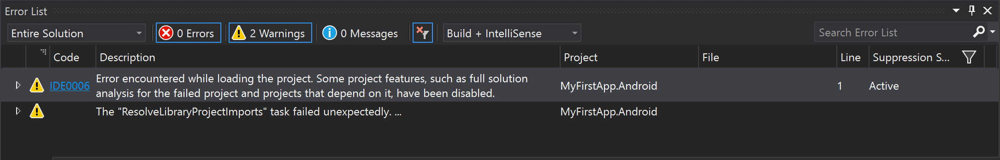

```
Severity	Code	Description	Project	File	Line	Suppression State
Warning		The "ResolveLibraryProjectImports" task failed unexpectedly.
System.IO.FileNotFoundException: Could not load assembly 'MyFirstApp, Version=0.0.0.0, Culture=neutral, PublicKeyToken='. Perhaps it doesn't exist in the Mono for Android profile?
File name: 'MyFirstApp.dll'
   at Java.Interop.Tools.Cecil.DirectoryAssemblyResolver.Resolve(AssemblyNameReference reference, ReaderParameters parameters)
   at Java.Interop.Tools.Cecil.DirectoryAssemblyResolver.Resolve(String fullName, ReaderParameters parameters)
   at Java.Interop.Tools.Cecil.DirectoryAssemblyResolver.Resolve(String fullName)
   at Java.Interop.Tools.Cecil.DirectoryAssemblyResolver.GetAssembly(String fileName)
   at Xamarin.Android.Tasks.ResolveLibraryProjectImports.Extract(DirectoryAssemblyResolver res, ICollection`1 jars, ICollection`1 resolvedResourceDirectories, ICollection`1 resolvedAssetDirectories, ICollection`1 resolvedEnvironments)
   at Xamarin.Android.Tasks.ResolveLibraryProjectImports.Execute()
   at Microsoft.Build.BackEnd.TaskExecutionHost.Microsoft.Build.BackEnd.ITaskExecutionHost.Execute()
   at Microsoft.Build.BackEnd.TaskBuilder.<ExecuteInstantiatedTask>d__26.MoveNext()	MyFirstApp.Android			
```

### App builds but crashes when deployed

<p>

From time to time you may encounter an issue of your app building without any errors,deploys fine and installs on your device, the app launches but immediately crashes without any real errors in the debug window indicating what the error was. Below are steps you can take to fix such issues.  

</p>

1. Navigate to Settings -> Apps and scroll down until you see 'Xamarin.Android API-[Version Number] Support'. Tap on each and tap 'Uninstall'.

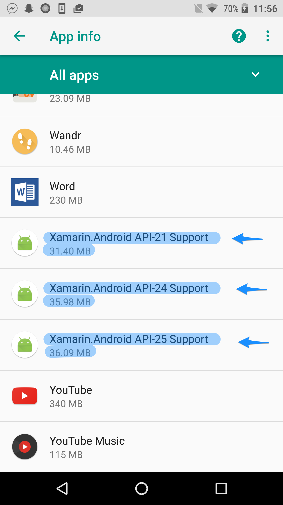

2. Scroll up until you find 'Mono Shared Runtime' and tap uninstall.

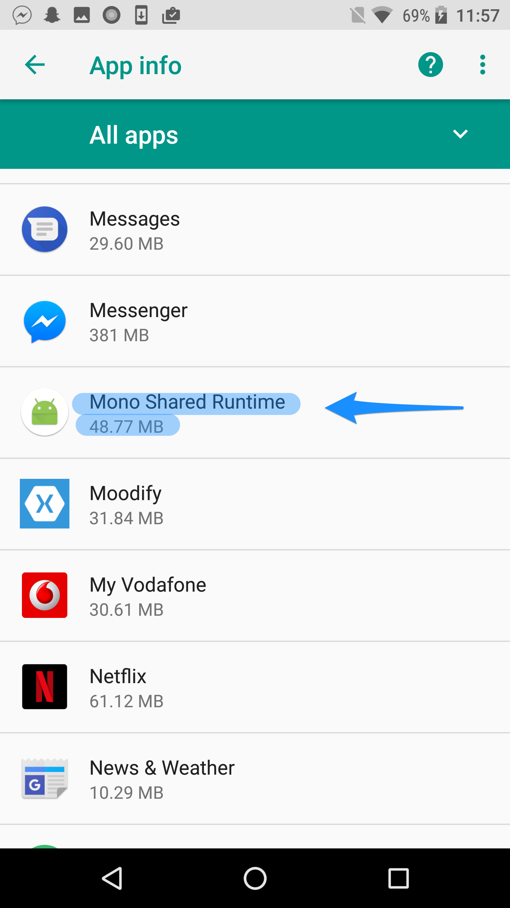

3. Look for the name of your Xamarin app and also uninstall it.
4. Inside Visual Studio/Xamarin Studio, right click on your Android project, click 'Rebuild' and then run the project again.

<p>

If the above steps still don't work for you, try disabling 'Shared Mono Runtime' from Visual Studio/Xamarin Studio.

#### Mac

</p>

5a. Right click on your Android project and click 'Options'.

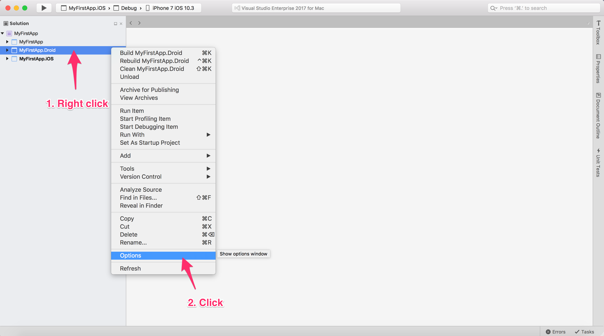

5b. Under 'Android Build', make sure 'Use Shared Mono Runtime' is unchecked. Click 'OK' when you're done. 

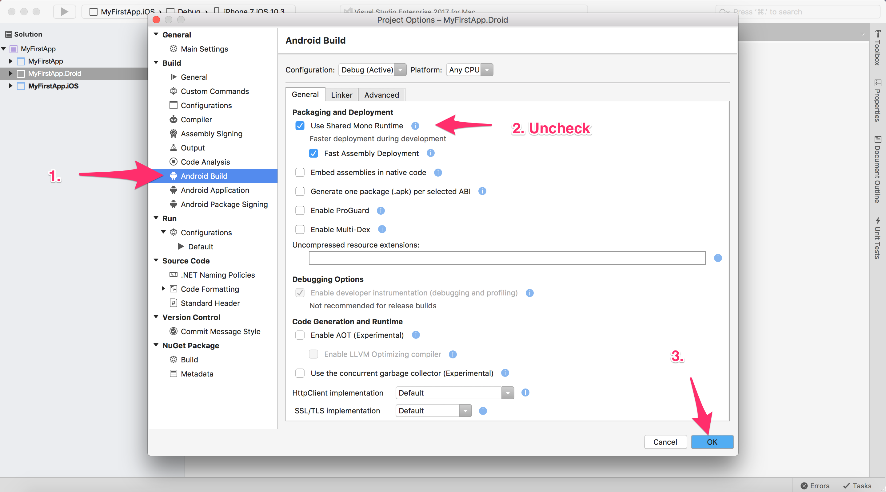

#### Windows

5a. Right click on your Android project.

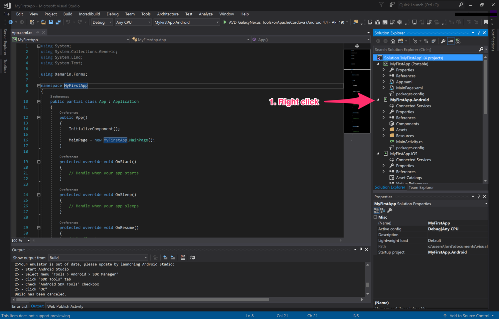

5b. Click on 'Properties'

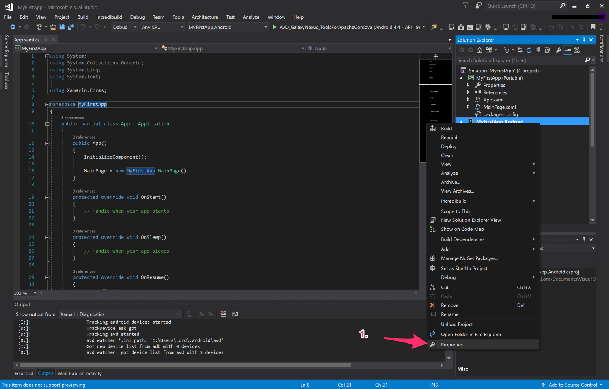

5c. Click 'Android Options', make sure 'Use Shared Runtime' is unchecked, and then click save.

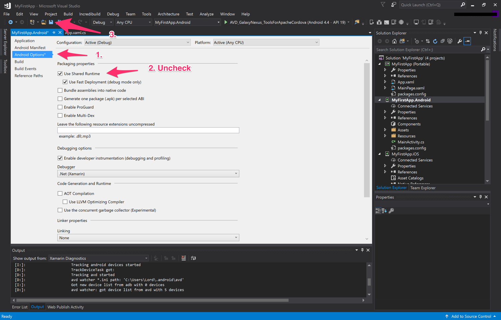

6. Now repeat steps 1-4 and you should be good.

### TargetFrameworkVersion package issue

<p>

```
The $(TargetFrameworkVersion) for Xamarin.Forms.Platform.Android.dll (v7.1) is greater than the $(TargetFrameworkVersion) for your project (v6.0). You need to increase the $(TargetFrameworkVersion) for your project.
```

If you see a message like this while trying to build and deploy your Android project, you're probably missing Android 7.1 SDK. 

</p>

#### Mac

1. Click 'Tools', then from the drop down menu select 'SDK Manager'.

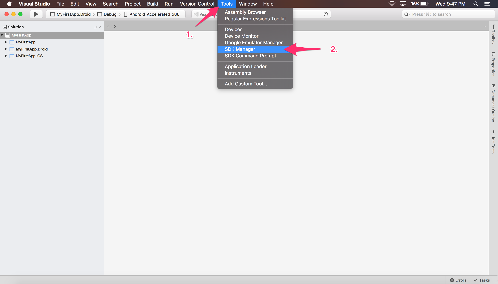

2. You should then see a popup window called 'Android SDKs and Tools'. This is where you can update your emulator, SDKs and build tools. From 'Platforms,' check 'Android 7.1 - Nougat' and 'Android 7.0 - Nougat' and then click 'Install Updates'.

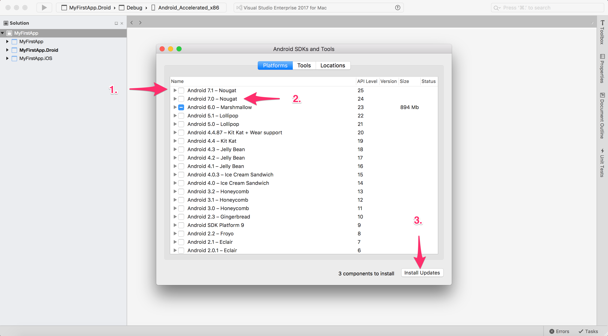

3. You'll then get a popup asking you to accept the terms of using the SDKs. Click 'Accept' and wait for everything to finish downloading.

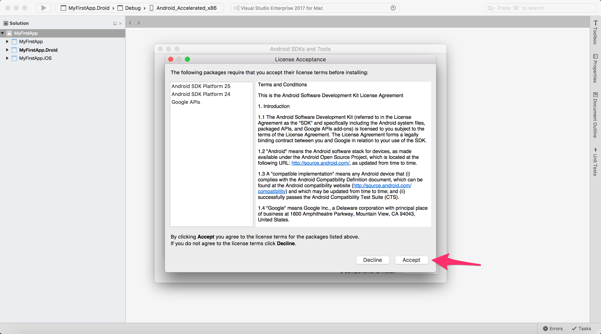

#### Windows

1. Click 'SDK Manager'. 

2. make sure you have 'Android 7.1.1 (API 25)' and 'Android 7.0 (API 24)'. 

3. Once done, click 'Install'. You'll be prompted to accept the terms of using the SDKs. Click 'Accept All' and wait for everything to download. 

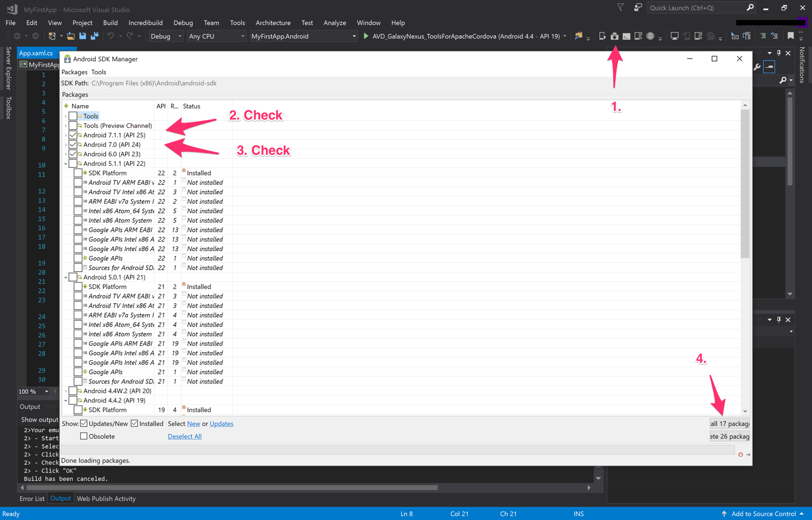

### Updating NuGet packages

#### Mac

1. Right click on your solution, and click 'Update NuGet Packages'. This may take some time depending on your internet connection.

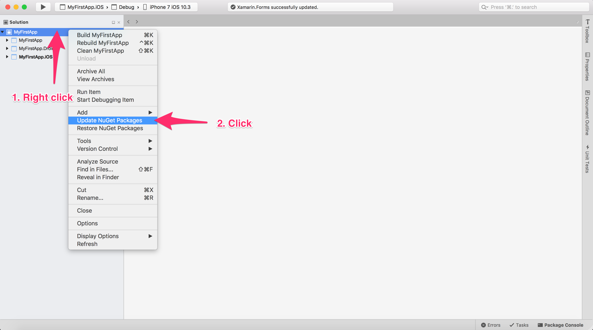

#### Windows

1. Right click on the solution at the top of solution explorer.

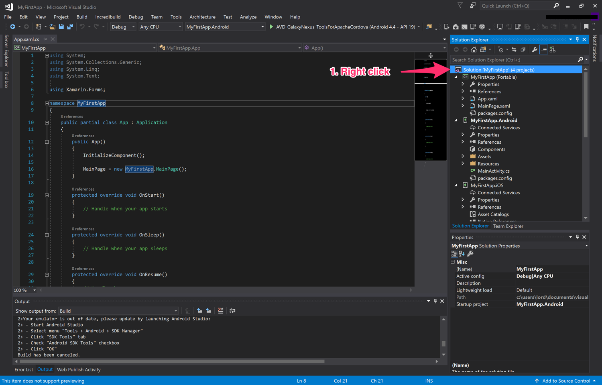

2. Click 'Manage NuGet Packages for Solution...'


3. Click 'Updates,' check 'Select all packages,' then click 'Update'. Now wait for everything to download and install. This may take awhile, depending on your internet connection.

<b>Note</b> - After everything has downloaded and installed you may see a message saying some NuGet package was unable to install and asking you to restart. Don't worry too much about it. Simply click 'Restart' and wait for Visual Studio to relaunch.

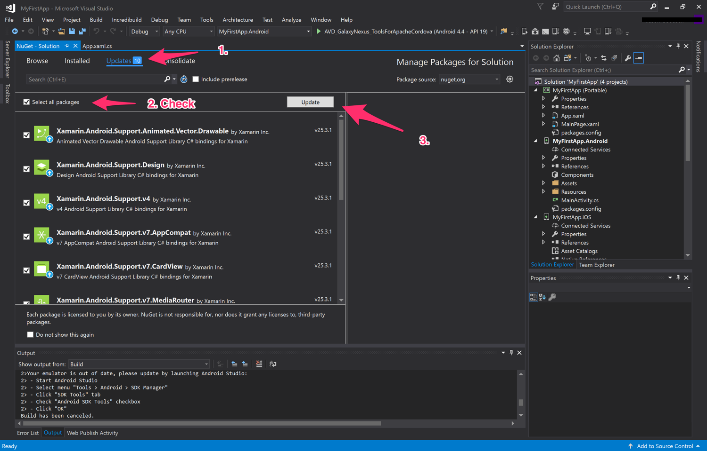

 ### Emulator issues

 <p>

On Windows, if you're having issues running the emulator you may need to enable Hyper-V (if your device supports it). Each machine is different so in order to enable Hyper-V you will need to do a quick Bing search on how to do that for your specific make and model. 

Alternatively, the easiest and (in my opinion) the best way to deploy and debug your app is using an actual Android device. But before you can do that, you'll need to enable a couple things on that device first before you can use it for debugging.

<b>Note</b> - I will be using a Nexus 6P running Android O DP 2. However, the steps will be more or less the same regardless.

 </p>

 1. On your Android device, navigate to 'Settings' -> 'System' -> 'About phone' and scroll down until you see 'Build number'. Tap on it about 7 times and you'll get a popup letting you know developer mode has been enable.

 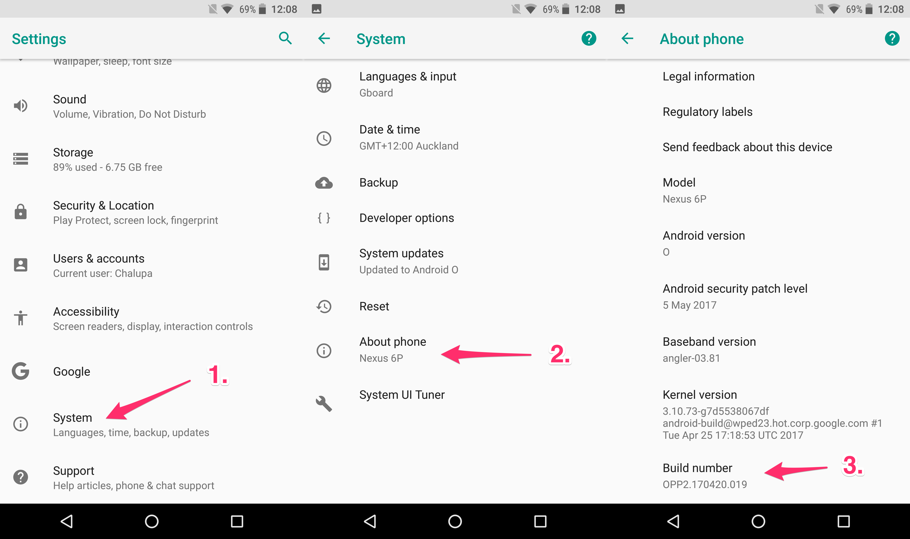

 2. Navigate back one and you should now see 'Developer options'. Tap on it, make sure developer mode is turned on, scroll down until you see 'USB debugging' and make sure it's switched on.

 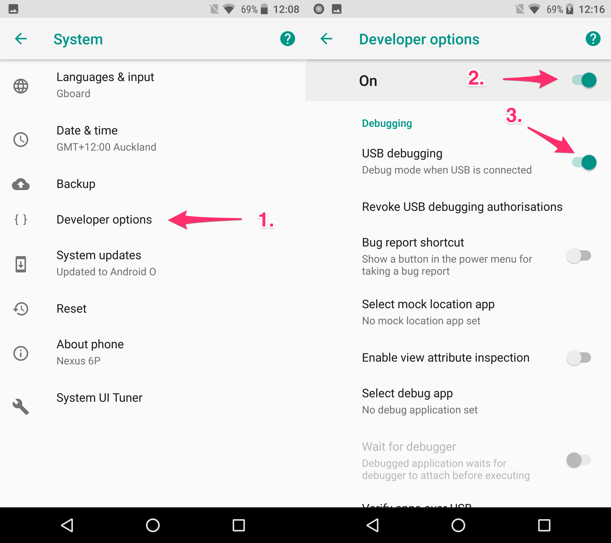

 3. Now inside Visual Studio/Xamarin Studio you should be able to see your physical device as option to deploy your app to. 